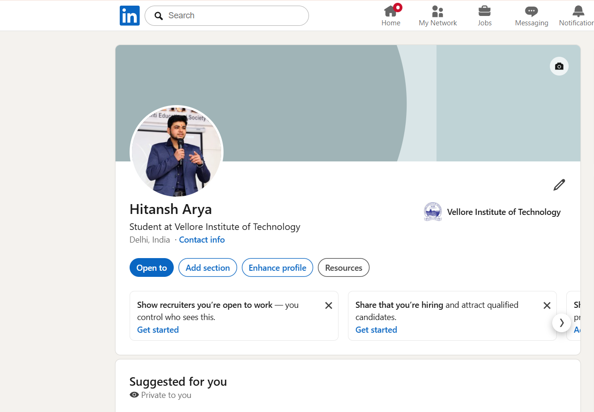

# Digital Literacy Portfolio

> **CSE0001 – Digital Literacy &nbsp;|&nbsp; VIT Bhopal University**

---

## Student Details

| Field | Details |
|:---|:---|
| Name | Hitansh Arya |
| Registration No. | 25BCE11059 |
| Branch | B.Tech – Computer Science Engineering |
| Year | First Year (2025–26) |
| Course Code | CSE0001 – Digital Literacy |
| Platform | VITyarthi E-Learning Platform |

---

## Repository Structure

```
digital-literacy-project/
│
├── README.md
├── report/
│   └── Project_Report_DL.pdf
│
├── task-1-presentation/
│   └── By HITANSH ARYA.pdf
│
├── task-2-portfolio/
│   ├── Github.png
│   ├── Linkedin.png
│   ├── StackOverflow.png
│
├── task-3-platforms/
│   ├── hackerrank.png
│   ├── google-form.png
│   └── google-sheets.png
│
├── task-4-email-etiquette/
│   ├── Hitansh emails DL.pdf
│   └── social-media-checklist.md
│
└── task-5-cybercrime/
    ├── casestudy.md
    └── prevention-checklist.md
```

---

## Tasks

### Task 1 &nbsp;—&nbsp; Digital Literacy Awareness Infographic

Created a one-page infographic using Canva covering four topics: what digital literacy is,
safe internet practices, professional online presence, and email etiquette.

→ See [`task-1-presentation/`](task-1-presentation/) for the design.

---

### Task 2 &nbsp;—&nbsp; Student Digital Portfolio

Set up professional profiles on GitHub, LinkedIn, Stack Overflow, and Kaggle.

| Platform | Profile |
|:---|:---|
| GitHub | [hitansh25bce11059-lang](https://github.com/hitansh25bce11059-lang) |
| LinkedIn | [Hitansh Arya](https://www.linkedin.com/in/hitansh-arya-0728533bb/) |
| Stack Overflow | [Hitansh Arya](https://stackoverflow.com/users/32568440/hitansh-arya) |

<br>

| GitHub | LinkedIn |
|:---:|:---:|
|  |  |

| Stack Overflow |
|:---:|:---:|
|  

→ See [`task-2-portfolio/`](task-2-portfolio/) for all screenshots.

---

### Task 3 &nbsp;—&nbsp; Coding and Collaboration Platforms

**Part A** &nbsp;—&nbsp; Completed the *Solve Me First* challenge on HackerRank (Algorithms – Warmup).

**Part B** &nbsp;—&nbsp; Built a 5-question Digital Literacy Awareness Quiz on Google Forms.

| | |
|:---|:---|
| Google Form | [Digital Literacy Awareness Quiz](https://docs.google.com/forms/d/e/1FAIpQLSdak-Vy6Y1Ifi_WkTNcwBpR7znvkZIJTJrqeGJdfEICQhBQvw/viewform?usp=publish-editor) |

→ See [`task-3-platforms/`](task-3-platforms/) for screenshots.

---

### Task 4 &nbsp;—&nbsp; Professional Email and Etiquette Guide

Drafted two professional emails — one requesting a deadline extension from a professor,
one expressing interest in a summer internship. Also created a Social Media Do's and
Don'ts checklist for college students.

→ See [`task-4-email-etiquette/`](task-4-email-etiquette/) for the drafts and checklist.

---

### Task 5 &nbsp;—&nbsp; Cybercrime Awareness Case Study

Wrote a case study on UPI phishing and digital payment fraud in India — covering how
attacks are structured, who gets targeted, and what the consequences look like. Also
created a Stay Safe Online checklist with practical tips for college students, including
two tips specific to UPI and financial safety.

| Resource | Link |
|:---|:---|
| National Cyber Crime Portal | [cybercrime.gov.in](https://cybercrime.gov.in) |
| Helpline | 1930 (24×7) |

→ See [`task-5-cybercrime/`](task-5-cybercrime/) for the case study and checklist.

---

## Project Report

Full written report covering all five tasks is in [`report/`](report/).

---

## Author

**Rachit Srivastava** &nbsp;|&nbsp; 25BCE11038  
B.Tech Computer Science Engineering &nbsp;|&nbsp; VIT Bhopal University

---

<sub>Submitted as part of CSE0001 – Digital Literacy &nbsp;|&nbsp; VIT Bhopal University</sub>
